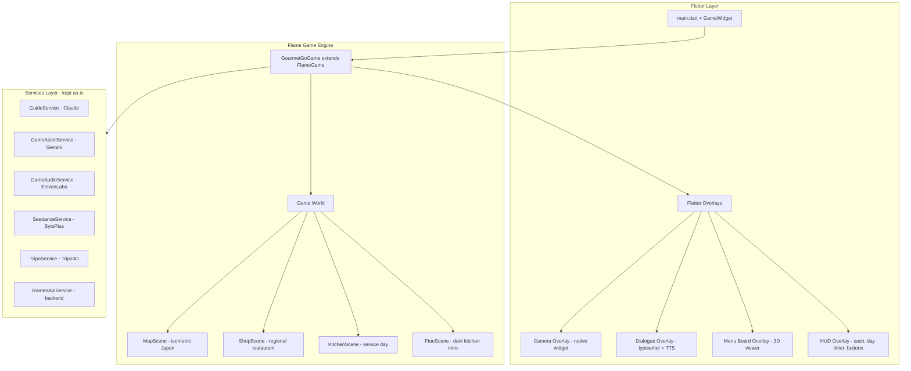
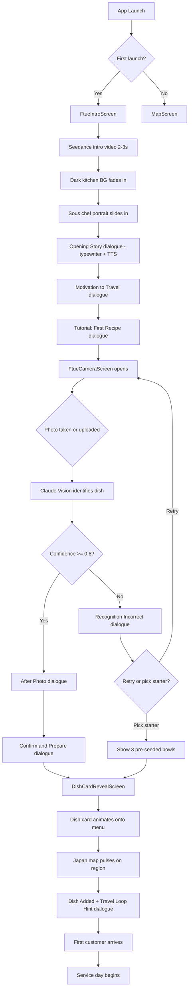
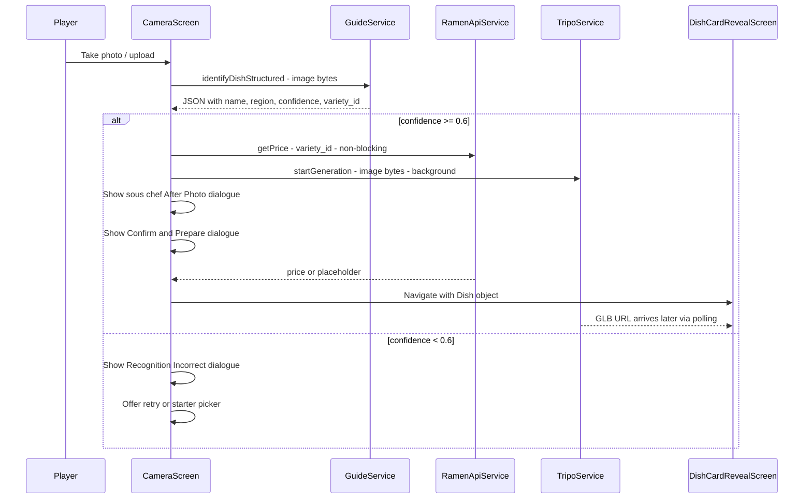
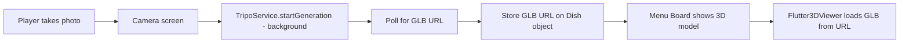

# FTUE Implementation Plan — Gourmet GO

## Overview

Build the First-Time User Experience from the [restaurant_sim_prototype.md](../gourmet_go/docs/restaurant_sim_prototype.md) Section 4, plus the supporting screens and API integrations needed for the full FTUE-to-service flow. The FTUE is the tutorial — no separate onboarding, no popups. The entire premise is established through the sous chef's voice in ~90 seconds.

> **Related docs** (on `chore/set-up-game-context`, now merged):
> - [`docs/flame_implementation.md`](../gourmet_go/docs/flame_implementation.md) — Full Flame architecture, component tree, 10-phase build, data models, providers
> - [`docs/sprite_generation_plan.md`](../gourmet_go/docs/sprite_generation_plan.md) — 42 sprites + 3 sheets, charcoal BG, batch generation by phase
> - [`docs/todo.md`](../gourmet_go/docs/todo.md) — Tiered build TODO (Tier 0 = Flame migration, Tier 1–3 = features)

### Architecture Decision: Flame Game Engine

The project uses a trimmed Flame ecosystem in [`pubspec.yaml`](../gourmet_go/pubspec.yaml) — `flame`, `flame_audio`, `flame_riverpod`, `flame_svg`, `flame_behaviors`, `flame_jenny`, `flame_splash_screen`. Removed: `flame_tiled`, `flame_forge2d`, `flame_rive` (not needed for this prototype).

**The existing Flutter widget screens were prototypes. They will be replaced with a Flame-based game.**

**KEEP** — the API services, test dashboard, models, and fixtures are all battle-tested and valuable:
- All services in `lib/services/` — these are pure Dart HTTP clients, engine-agnostic
- [`ApiTestScreen`](../gourmet_go/lib/screens/api_test_screen.dart) — stays as a plain Flutter route for dev/testing
- Models: `Recipe`, `PrepStep`, `Region`, plus new `Dish`
- Fixtures and generated assets

**REPLACE** — rebuild as Flame game components with Flutter overlays:
- `map_screen.dart` → `FlameGame` world with isometric map components
- `ramen_shop_screen.dart` → Flame scene/component
- `visual_novel_screen.dart` → Flame dialogue overlay system
- `camera_screen.dart` → Flutter overlay on the Flame game (camera requires native widgets)
- Stubs: `restaurant_screen.dart`, `reveal_screen.dart`, `prep_loop_screen.dart`

### Flame Architecture Overview



### Target Flow

```
App loads → Seedance intro clip 2-3s → Dark kitchen screen →
Sous chef speaks opening story → Motivation to travel →
Camera opens → Player photographs or uploads ramen →
Vision AI identifies bowl → Dish card created → Menu updated →
Japan map pulses → First customer arrives → Service begins
```

---

## Current State Analysis

### What Exists (Post Phase 0)

| Component | Status | File |
|-----------|--------|------|
| **GourmetGoGame** (FlameGame) | ✅ Created | `lib/game/gourmet_go_game.dart` |
| **main.dart** — GameWidget + ProviderScope | ✅ Rewritten | `lib/main.dart` |
| Old screens | ✅ Moved to deprecated | `lib/deprecated/screens/` |
| GuideService — Claude dish ID | ✅ Working | `services/guide_service.dart` |
| GameAssetService — Gemini sprites | ✅ Working | `services/game_asset_service.dart` |
| GameAudioService — SFX + TTS | ✅ Working | `services/game_audio_service.dart` |
| SeedanceService — video gen | ✅ Working | `services/seedance_service.dart` |
| ElevenLabsService — narration TTS | ✅ Working | `services/elevenlabs_service.dart` |
| Region model | ✅ Working | `models/region.dart` |
| Recipe model | ✅ Working | `models/recipe.dart` |
| ApiTestScreen | ✅ Preserved | `screens/api_test_screen.dart` |
| Sprite generation pipeline | ✅ Reference exists | `docs/sprite_generation_example/` |
| Sprite generation plan | ✅ New | `docs/sprite_generation_plan.md` |
| Flame implementation plan | ✅ New | `docs/flame_implementation.md` |
| Dish model | ❌ Stub only | `models/dish.dart` |
| FTUE screen | ❌ Does not exist | — |
| FTUE state tracking | ❌ Does not exist | — |
| Sous chef character assets | ❌ Generated at runtime only | — |
| Dark kitchen background | ❌ Does not exist | — |
| FTUE-specific audio | ❌ Does not exist | — |
| Intro video clip | ❌ Does not exist | — |

### What Needs to Change

| Component | Change |
|-----------|--------|
| `main.dart` | Route to FTUE on first launch instead of `/map` |
| `dish.dart` | Full Dish model with rarity, region, lore, price, photo thumbnail, GLB URL |
| `region.dart` | Add `rarityTier` field matching design doc tiers |
| `guide_service.dart` | Add `identifyDishStructured()` returning JSON with confidence score |
| `game_asset_service.dart` | Add sous chef portrait, dark kitchen BG, dish card icon prompts |
| `game_audio_service.dart` | Add FTUE-specific SFX entries and intro music track |
| `generate_audio.sh` | Add FTUE audio generation commands |
| `camera_screen.dart` | Full rework: structured recognition, confidence branching, dish card creation, Tripo 3D kickoff |
| NEW `menu_board_screen.dart` | Scrollable dish card grid with 3D model viewer per dish |
| NEW `ramen_api_service.dart` | Backend API client for `GET /ramen/varieties` and `GET /ramen/{variety_id}/price` |
| `dish_card.dart` | Full widget with rarity borders, photo thumb, 3D model tap, region lore |

---

## Phase 0 — Flame Migration *(DONE)*

> Corresponds to [Tier 0 in `docs/todo.md`](../gourmet_go/docs/todo.md) and
> [Phases 1–3 of `docs/flame_implementation.md`](../gourmet_go/docs/flame_implementation.md).

### 0A. GourmetGoGame + main.dart ✅

- [x] Created [`lib/game/gourmet_go_game.dart`](../gourmet_go/lib/game/gourmet_go_game.dart) — `FlameGame` subclass with `CameraComponent.withFixedResolution(390, 844)`, `GameOverlay` enum, world-swapping via `switchScene()`, overlay helpers
- [x] Rewrote [`lib/main.dart`](../gourmet_go/lib/main.dart) — `ProviderScope` → `MaterialApp` (theme) → `GameWidget` with overlay builders for all `GameOverlay` values. Debug FAB toggles `ApiTestScreen`
- [x] Background color: `#0F0F1A` (dark navy, matches charcoal theme)

### 0B. pubspec.yaml Cleanup ✅

- [x] Removed `flame_tiled`, `flame_forge2d`, `flame_rive` (upstream did this)
- [x] Moved `flame_test`, `flame_lint`, `riverpod_lint`, `very_good_analysis` to `dev_dependencies`
- [x] Added `shared_preferences: ^2.2.0`, `flutter_riverpod: ^3.3.1`, `hooks_riverpod: ^3.0.0`
- [x] `flutter pub get` clean

### 0C. Old Screens Deprecated ✅

- [x] Moved all old widget screens to `lib/deprecated/screens/`
- [x] Preserved `ApiTestScreen` at `lib/screens/api_test_screen.dart`
- [x] Added `analyzer: exclude: - lib/deprecated/**` to [`analysis_options.yaml`](../gourmet_go/analysis_options.yaml)

### 0D. Remaining (Next Steps)

- [ ] Upgrade `GourmetGoGame` to use `RiverpodGameMixin` (per `flame_implementation.md`)
- [ ] Switch `GameWidget` to `RiverpodAwareGameWidget` (per `flame_implementation.md`)
- [ ] Create Riverpod providers: `cashProvider`, `chefProvider`, `gameStateProvider`, `menuProvider`, `ftueProvider`, `regionProvider`
- [ ] Implement `Dish` model per API contract (Tier 0 task)
- [ ] Update `GuideService.identifyDish()` to return structured JSON (Tier 0 task)

---

## Phase 1 — Asset Generation (Pre-Build)

These run offline via scripts before Flutter code changes.

### 1A. Sprite Generation Script

Create `gourmet_go/scripts/generate_ftue_sprites.py` modelled on the existing [`generate_sprites.py`](../gourmet_go/docs/sprite_generation_example/generate_sprites.py) pipeline.

**Sprites to generate:**

| Sprite | Description | Use Reference | Art Style |
|--------|-------------|---------------|-----------|
| `sous_chef_portrait` | Bust portrait for visual novel dialogue — warm, wise, older character | No - new character | Dreamy anime-inspired, bold outlines, flat pastel colours |
| `sous_chef_sprite` | Full body sprite for map/shop walking | Yes - from portrait | Same style |
| `dark_kitchen_bg` | Dimly lit ramen kitchen interior, moody, atmospheric | No | Isometric, warm shadows, modern indie |
| `kitchen_bg_tier1` | Run-down family shop kitchen (starting tier) | No | Isometric pixel art, warm but worn |
| `kitchen_bg_tier2` | Clean neighbourhood spot kitchen | No | Isometric pixel art, brighter, tidier |
| `kitchen_bg_tier3` | Popular local eatery kitchen | No | Isometric pixel art, bustling, warm |
| `kitchen_bg_tier4` | Destination ramen bar kitchen | No | Isometric pixel art, premium, polished |
| `kitchen_bg_tier5` | Legendary ramen institution kitchen | No | Isometric pixel art, grand, iconic |
| `chef_ken_idle` | Starter chef Ken — standing idle at station, toque + apron | No | Same art style, Kanto shoyu vibe |
| `chef_ken_cooking` | Ken stirring pot, focused expression | Yes - from idle | Same style |
| `chef_ken_plating` | Ken placing toppings on bowl | Yes - from idle | Same style |
| `chef_ken_rest` | Ken wiping brow, brief break pose | Yes - from idle | Same style |
| `dish_card_frame` | Card frame/border with rarity colour variants | No | UI element, clean, flat |
| `ramen_bowl_icon_generic` | Generic steaming ramen bowl icon for first dish card | No | Icon style, warm colours |
| `ramen_bowl_icon_kanto` | Tokyo shoyu ramen bowl — clear brown broth | No | Icon style, region-specific |
| `ramen_bowl_icon_hokkaido` | Sapporo miso ramen bowl — rich amber broth | No | Icon style, region-specific |
| `ramen_bowl_icon_tohoku` | Kitakata ramen bowl — wavy noodles, clear broth | No | Icon style, region-specific |
| `ramen_bowl_icon_kyushu` | Hakata tonkotsu — milky white broth | No | Icon style, region-specific |
| `customer_placeholder` | Generic customer silhouette (fallback while LLM generates) | No | Simple, clean |

**Art style override** per README: *"Dreamy anime-inspired isometric pixel art — flat pastel colours, bold outlines, modern indie aesthetic"*

The script will:
1. Use Gemini `gemini-2.5-flash-image` as primary generator
2. Request solid `#00FF88` lime-green backgrounds
3. Post-process with PIL chroma-key removal
4. Output to `gourmet_go/assets/images/ftue/`
5. Also generate a reference atlas for review

### 1B. FTUE Audio Generation

Add to `generate_audio.sh` or create `generate_ftue_audio.sh`:

| Asset | Type | Prompt |
|-------|------|--------|
| `music_ftue_intro.mp3` | Music | Gentle emotional piano and strings, slow build, nostalgic and warm, Japanese restaurant story opening |
| `music_kitchen.mp3` | Music | Warm busy kitchen background music, gentle upbeat tempo, simmering pots and soft percussion, loopable, cozy Japanese restaurant service day feel |
| `sfx_kitchen_ambience.mp3` | SFX | Quiet empty kitchen ambience, distant simmering pot, gentle fan hum, peaceful |
| `sfx_dish_card_reveal.mp3` | SFX | Magical sparkling reveal sound, ascending chimes, achievement unlocked, warm |
| `sfx_map_pulse.mp3` | SFX | Soft pulsing glow sound, map region lighting up, ethereal |
| `sfx_customer_arrive.mp3` | SFX | Restaurant door bell, cheerful short jingle, customer entering |
| `sfx_order_placed.mp3` | SFX | Paper ticket stamp sound, quick crisp, order placed on rail, restaurant service |
| `sfx_bowl_served.mp3` | SFX | Ceramic bowl placed on counter with gentle clink, served dish, satisfying |
| `sfx_cash_ding.mp3` | SFX | Cash register ding, money earned, cheerful coin sound, short |
| `sfx_day_end.mp3` | SFX | End of day wind-down, kitchen fans slowing, gentle closing chime, reflective |
| `sfx_upgrade_purchase.mp3` | SFX | Upgrade purchased sparkle sound, level up, improvement jingle, positive |
| `sfx_star_rating.mp3` | SFX | Star rating reveal, ascending bell tones per star, building anticipation |

### 1C. Seedance / ByteDance Video Clips

Use [`SeedanceService`](../gourmet_go/lib/services/seedance_service.dart) to pre-generate all video clips. **All are pre-baked to `assets/videos/` — never generated at runtime.**

| Clip | Duration | Prompt | Trigger | Source |
|------|----------|--------|---------|--------|
| `ftue_intro.mp4` | 2-3s | A dimly lit Japanese ramen kitchen slowly illuminating, warm golden light spreading across wooden counters and hanging lanterns, steam rising gently, cinematic, dreamy anime aesthetic | App first launch (ByteDance §11.4) | ByteDance |
| `day_start_doors.mp4` | 1-2s | Kitchen doors swinging open, morning light flooding in, wooden counter and stools, warm inviting ramen restaurant, cinematic | Day start transition (ByteDance §11.4) | ByteDance |
| `seedoms_happy_common.mp4` | 2-3s | Happy customer smiling at ramen bowl, warm lighting, cozy restaurant, upbeat mood, anime style | 3-star bowl served (Common) (Seedoms §11.3) | Seedoms |
| `seedoms_emotional_rare.mp4` | 2-3s | Customer visibly moved tasting ramen, emotional reaction, soft light, intimate moment, cinematic | 3-star bowl served (Rare/Legendary) (Seedoms §11.3) | Seedoms |
| `seedoms_signature.mp4` | 3-4s | Montage of multiple customers enjoying same bowl of ramen, busy happy restaurant, warm anime style | Signature bowl unlocked (Seedoms §11.3) | Seedoms |
| `seedoms_perfect_day.mp4` | 2-3s | Restaurant exterior, full queue forming outside, golden hour light, bustling neighbourhood, anime pixel art | Perfect day (5-star rating) (Seedoms §11.3) | Seedoms |
| `seedoms_region_common.mp4` | 1-2s | Busy recognisable Japanese street scene, neon signs, bustling crowds, urban energy | Region unlocked (Common) (Seedoms §11.3) | Seedoms |
| `seedoms_region_rare.mp4` | 2-3s | Quiet atmospheric Japanese countryside, fog over coastline, lantern in market alley, peaceful and mysterious | Region unlocked (Rare/Legendary) (Seedoms §11.3) | Seedoms |

**Design doc rules (§11.3):** Pre-generate and cache 8–10 clips. Do NOT call live during gameplay. Maximum 1 clip per day.

---

## Phase 2 — Service & Model Updates

### 2A. Dish Model

Replace the stub [`dish.dart`](../gourmet_go/lib/models/dish.dart) with a full model:

```dart
class Dish {
  final String id;
  final String name;
  final String regionalStyle;
  final String brothBase;
  final RarityTier rarityTier;
  final String regionalLore;
  final String? photoPath;       // Player photo thumbnail
  final Uint8List? photoBytes;
  final double? price;           // From backend, display-only
  final int timesServed;
  final double avgStars;
  final DateTime discoveredAt;
  
  // ... factory fromGuideResponse, toJson, fromJson for persistence
}

enum RarityTier { common, uncommon, rare, legendary }
```

Persist via `shared_preferences` as JSON array, excluding `photoBytes` and `price`.

### 2B. FTUE State Service

New file `lib/services/ftue_service.dart`:

```dart
class FtueService {
  // Checks shared_preferences for 'ftue_completed' flag
  Future<bool> isFirstLaunch();
  // Sets flag after FTUE completes
  Future<void> markFtueComplete();
  // Stores the first dish created during FTUE
  Future<void> saveFirstDish(Dish dish);
}
```

### 2C. GuideService Updates

Add a new method to [`GuideService`](../gourmet_go/lib/services/guide_service.dart):

```dart
/// Returns structured JSON: { ramen_name, regional_style, broth_base,
///   regional_lore, confidence_0_to_1 }
Future<Map<String, dynamic>> identifyDishStructured(Uint8List imageBytes);
```

This is needed because the FTUE has branching logic based on `confidence < 0.6` — the current [`identifyDish()`](../gourmet_go/lib/services/guide_service.dart:86) returns a prose string, not structured data.

The structured prompt should ask Claude to return:
```json
{
  "ramen_name": "Hakata Tonkotsu Ramen",
  "regional_style": "Fukuoka",
  "broth_base": "tonkotsu",
  "regional_lore": "Born in the bustling yatai stalls of Fukuoka...",
  "confidence_0_to_1": 0.92,
  "variety_id": "hakata_tonkotsu"
}
```

The `variety_id` maps to the ramen varieties catalogue from the backend API.

### 2F. Ramen API Service (Backend Contract)

New file: `lib/services/ramen_api_service.dart`

Implements the two API endpoints from [design doc Section 8](../gourmet_go/docs/restaurant_sim_prototype.md:386):

```dart
class RamenApiService {
  /// GET /ramen/varieties
  /// Called at session start and after each dish card creation.
  /// Returns canonical list of recognised ramen types.
  /// Cached for the session; re-fetched on next app launch.
  Future<List<RamenVariety>> getVarieties();
  
  /// GET /ramen/{variety_id}/price
  /// Called immediately after vision AI identifies a dish.
  /// Returns price displayed on dish card and used in cash calc.
  Future<DishPrice?> getPrice(String varietyId);
}

class RamenVariety {
  final String varietyId;
  final String name;
  final String regionalStyle;
  final String brothBase;
  final RarityTier rarityTier;
}

class DishPrice {
  final int price;
  final String currency;  // Always '¥' for hackathon
}
```

**Client behaviour per design doc:**
- Cache the variety catalogue for the session; re-fetch on next app launch
- If the price endpoint is unavailable, display "—" and retry silently
- Price is display-only on client; backend is source of truth
- Never block dish card creation if price fetch fails

**Hackathon implementation:** Since there is no real backend server yet, the service will use a local JSON fixture with variety data and prices, structured so it can be swapped for real HTTP calls later. The fixtures already exist in a compatible format at [`lib/fixtures/ramen.json`](../gourmet_go/lib/fixtures/ramen.json).

### 2G. Ramen Varieties Fixture

New file: `lib/fixtures/ramen_varieties.json`

The canonical list of recognised ramen types for the `GET /ramen/varieties` endpoint (design doc §8). This is what `RamenApiService.getVarieties()` returns from local fixture in hackathon mode.

```json
[
  { "variety_id": "tokyo_shoyu", "name": "Tokyo Shoyu Ramen", "regional_style": "Kanto", "broth_base": "shoyu", "rarity_tier": "common", "price": 850 },
  { "variety_id": "ie_kei", "name": "Ie-kei Ramen", "regional_style": "Kanto", "broth_base": "tonkotsu_shoyu", "rarity_tier": "common", "price": 900 },
  { "variety_id": "tsukemen", "name": "Tsukemen", "regional_style": "Kanto", "broth_base": "shoyu", "rarity_tier": "common", "price": 950 },
  { "variety_id": "sapporo_miso", "name": "Sapporo Miso Ramen", "regional_style": "Hokkaido", "broth_base": "miso", "rarity_tier": "uncommon", "price": 1100 },
  { "variety_id": "hakodate_shio", "name": "Hakodate Shio Ramen", "regional_style": "Hokkaido", "broth_base": "shio", "rarity_tier": "uncommon", "price": 1050 },
  { "variety_id": "asahikawa_shoyu", "name": "Asahikawa Shoyu Ramen", "regional_style": "Hokkaido", "broth_base": "shoyu", "rarity_tier": "uncommon", "price": 1100 },
  { "variety_id": "hakata_tonkotsu", "name": "Hakata Tonkotsu Ramen", "regional_style": "Kyushu", "broth_base": "tonkotsu", "rarity_tier": "uncommon", "price": 1050 },
  { "variety_id": "kumamoto_tonkotsu", "name": "Kumamoto Tonkotsu Ramen", "regional_style": "Kyushu", "broth_base": "tonkotsu", "rarity_tier": "uncommon", "price": 1100 },
  { "variety_id": "kitakata_shoyu", "name": "Kitakata Shoyu Ramen", "regional_style": "Tohoku", "broth_base": "shoyu", "rarity_tier": "rare", "price": 1400 },
  { "variety_id": "yamagata_tori", "name": "Yamagata Tori-Chuuka Ramen", "regional_style": "Tohoku", "broth_base": "tori", "rarity_tier": "rare", "price": 1500 },
  { "variety_id": "kansai_chicken_shoyu", "name": "Kansai Light Chicken Shoyu", "regional_style": "Kansai", "broth_base": "shoyu", "rarity_tier": "common", "price": 800 }
]
```

### 2H. Sous Chef Fallback Lines Fixture

New file: `lib/fixtures/sous_chef_lines.json`

Design doc §9.1 requires 30+ pre-written fallback lines per category. These are used when LLM calls are unavailable, slow, or during the 1-call-per-4s rate limit.

```json
{
  "dish_recognition_common": [
    "Tokyo shoyu. A classic. Solid start for the menu.",
    "Ah, a familiar friend. Simple but well-made.",
    "Every kitchen needs its staples. Good choice, chef."
  ],
  "dish_recognition_rare": [
    "Kitakata-style? Chef, most people never make it there. This is something.",
    "Now that's a discovery. The regulars will talk about this one.",
    "Off the beaten path. Your grandfather would approve."
  ],
  "mid_service_pause": [
    "One moment, chef.",
    "Take your time. The kitchen can wait.",
    "A new discovery? Let me see."
  ],
  "queue_warning": [
    "The queue's getting long. Stay focused.",
    "Orders are stacking up, chef.",
    "We're getting busy. Keep the bowls moving."
  ],
  "end_of_day": [
    "Good day, chef. Here's what we earned — and here's what we could do with it.",
    "The shop is quiet now. Let's look at how we did.",
    "Another day done. Your grandfather's shop still stands."
  ],
  "discovery_nudge": [
    "The menu's good — but Tohoku is calling. Have you been north yet?",
    "There are whole regions waiting for you.",
    "I hear there's a broth in Kitakata that no one can explain."
  ],
  "grandfather_reference": [
    "Your grandfather always came back from Tohoku with something no one had tried before.",
    "He'd stand right where you are now, tasting the broth before anyone else.",
    "This shop has seen a lot of bowls. Yours is just beginning."
  ],
  "upgrade_suggestion": [
    "A faster chef would change everything. Worth considering.",
    "More counter seats might be the answer.",
    "The shop could use some love. An upgrade, perhaps?"
  ]
}
```

### 2I. Pre-Seeded Starter Bowls Fixture

New file: `lib/fixtures/starter_bowls.json`

Per design doc §4 (Recognition Incorrect branch): *"offer 3 pre-seeded starter dishes to choose from."* These are the fallback options when the camera fails.

```json
[
  {
    "variety_id": "hakata_tonkotsu",
    "name": "Hakata Tonkotsu Ramen",
    "regional_style": "Kyushu",
    "broth_base": "tonkotsu",
    "rarity_tier": "uncommon",
    "regional_lore": "Born in the bustling yatai stalls of Fukuoka, where chefs keep the broth rolling through the night.",
    "icon": "ramen_bowl_icon_kyushu"
  },
  {
    "variety_id": "sapporo_miso",
    "name": "Sapporo Miso Ramen",
    "regional_style": "Hokkaido",
    "broth_base": "miso",
    "rarity_tier": "uncommon",
    "regional_lore": "Hokkaido's answer to winter — rich, warm, and impossible to forget.",
    "icon": "ramen_bowl_icon_hokkaido"
  },
  {
    "variety_id": "tokyo_shoyu",
    "name": "Tokyo Shoyu Ramen",
    "regional_style": "Kanto",
    "broth_base": "shoyu",
    "rarity_tier": "common",
    "regional_lore": "The bowl that started it all. Clear, honest, and everywhere in the capital.",
    "icon": "ramen_bowl_icon_kanto"
  }
]
```

### 2J. Customer Generation Service

New file: `lib/services/customer_generation_service.dart`

Per design doc §9.3 and todo.md Tier 1 BE: *"Customer generation (LLM) with rarity-aware payload — 6–10 pre-generated per day at day start."*

```dart
class CustomerGenerationService {
  /// Pre-generates 6-10 customer personas at day start.
  /// Uses the player's current menu rarity profile + day number + restaurant tier.
  /// Falls back to pre-written customer templates if LLM unavailable.
  Future<List<Customer>> generateDayCustomers({
    required List<Dish> menu,
    required int dayNumber,
    required int restaurantTier,
    required String chefSkill,
  });
}

class Customer {
  final String name;
  final String personalityTag;
  final String orderedDishId;
  final CustomerPatience patience;  // hungry, relaxed, celebrating
  final String? reactionOnServe;    // LLM-generated post-serve (non-blocking)
}

enum CustomerPatience { hungry, relaxed, celebrating }
```

**Design doc rules:**
- Pre-generate 6-10 at day start, NOT live during service
- Menu rarity profile drives customer diversity — rare dishes attract more story-rich customers
- `patience` affects wait tolerance: hungry = short, relaxed = standard, celebrating = tips double
- Customer reactions generated non-blocking after serve (separate LLM call)

### 2K. Sous Chef Commentary Service

New file: `lib/services/sous_chef_service.dart`

Per design doc §9.1 and todo.md Tier 2 BE: *"FTUE sous chef dialogue — LLM integration; 30+ pre-written fallback lines per category."*

```dart
class SousChefService {
  /// Generates a contextual sous chef line based on game state.
  /// Rate-limited to max 1 call per 4 seconds during service.
  /// Falls back to pre-written lines from sous_chef_lines.json.
  Future<String> getCommentary(SousChefTrigger trigger, Map<String, dynamic> context);
  
  /// Generates end-of-day debrief line based on star rating.
  Future<String> getDayDebrief(int stars, Map<String, dynamic> dayStats);
  
  /// Generates customer serve reaction (non-blocking, post-serve).
  Future<String> getCustomerReaction(String dishName, RarityTier rarity, int qualityStars);
}

enum SousChefTrigger {
  dishRecognitionCommon,
  dishRecognitionRare,
  midServicePause,
  queueWarning,
  rareBowlServed,
  endOfDay,
  discoveryNudge,
  grandfatherReference,
  upgradeSuggestion,
}
```

**Design doc rules (§9.1):**
- Max 12 words per line during active service
- Longer reflective lines reserved for FTUE, end-of-day, between-session moments
- Max 1 LLM call per 4 seconds during service
- 30+ pre-written fallback lines per trigger category (from `sous_chef_lines.json`)
- 800ms timeout before fallback (design doc §12.1)

### 2D. GameAssetService Updates

Add to [`GameAssetService`](../gourmet_go/lib/services/game_asset_service.dart):

```dart
Future<Uint8List?> getSousChefPortrait();   // Warm, wise older character
Future<Uint8List?> getDarkKitchenBg();       // Moody dimly-lit kitchen
Future<Uint8List?> getDishCardIcon(String regionalStyle);  // Per-region icon
```

Update the `_styleGuide` constant to match the new README art direction:
*"Dreamy anime-inspired isometric pixel art — flat pastel colours, bold outlines, modern indie aesthetic"*

### 2E. GameAudioService Updates

Add new SFX entries to [`GameSfx`](../gourmet_go/lib/services/game_audio_service.dart:108) enum:

```dart
enum GameSfx {
  // ... existing entries (mapTap, chefWalk, doorOpen, arrive, photo, regionHover)
  kitchenAmbience('sfx_kitchen_ambience.mp3'),
  dishCardReveal('sfx_dish_card_reveal.mp3'),
  mapPulse('sfx_map_pulse.mp3'),
  customerArrive('sfx_customer_arrive.mp3'),
  orderPlaced('sfx_order_placed.mp3'),
  bowlServed('sfx_bowl_served.mp3'),
  cashDing('sfx_cash_ding.mp3'),
  dayEnd('sfx_day_end.mp3'),
  upgradePurchase('sfx_upgrade_purchase.mp3'),
  starRating('sfx_star_rating.mp3'),
}
```

Add new music methods:
- `playFtueMusic()` — intro track for FTUE
- `playKitchenMusic()` — service day BGM
- `playDayStartClip()` — triggers day-start video audio

Add `playSeedomsClip(String clipName)` for contextual video playback (max 1/day).

---

## Phase 3 — Screen Implementation

### FTUE Screen Flow Diagram



### 3A. FtueIntroScreen

New file: `lib/screens/ftue_intro_screen.dart`

**Behaviour:**
1. Play `ftue_intro.mp4` video clip (2-3s) — if asset missing, show dark fade-in
2. Crossfade to dark kitchen background
3. Sous chef portrait slides in from left (reuse animation pattern from [`visual_novel_screen.dart`](../gourmet_go/lib/screens/visual_novel_screen.dart:59))
4. Typewriter text delivers Opening Story + Motivation to Travel + Tutorial prompt
5. ElevenLabs TTS speaks each dialogue section in sequence
6. After "Tutorial: First Recipe" dialogue completes → transition to camera

**Key differences from existing VisualNovelScreen:**
- Multiple sequential dialogue sections, not a single quote
- Plays a video first
- Dark/moody tone instead of region-coloured
- Transitions to camera, not pushed from existing stack
- Sous chef character, not "Chef Guide"

**Dialogue sections** (from the design doc):
1. Opening Story — 4 paragraphs
2. Motivation to Travel — 2 paragraphs  
3. Tutorial: First Recipe — 2 paragraphs

### 3B. Camera Screen Rework

**Rework** the existing [`camera_screen.dart`](../gourmet_go/lib/screens/camera_screen.dart) to serve both FTUE and normal gameplay.

The current camera screen is basic — it takes a photo, sends to `identifyDish()` for a prose string, and shows results. The reworked version needs:

#### Core Changes
1. **Structured recognition**: Call `identifyDishStructured()` instead of `identifyDish()` — returns JSON with `ramen_name`, `regional_style`, `broth_base`, `regional_lore`, `confidence_0_to_1`, `variety_id`
2. **Price fetch**: After successful identification, call `RamenApiService.getPrice(varietyId)` — non-blocking, show "—" as placeholder
3. **Confidence branching**:
   - `>= 0.6` → sous chef "After Photo" line → "Confirm and Prepare" line → proceed to reveal
   - `< 0.6` → sous chef "Recognition Incorrect" line → retry or pick starter
4. **3D model kickoff**: On successful identification, fire `TripoService.startGeneration()` in background — the GLB URL arrives later and gets stored on the Dish object
5. **Dish object creation**: Build a `Dish` model from the structured response + price + photo bytes
6. **Sous chef overlay**: Mini visual novel dialogue overlay at the bottom with portrait thumbnail and typewriter text
7. **Mode parameter**: Accept `isFtue: bool` to control whether to show FTUE-specific dialogue or normal gameplay dialogue

#### FTUE Mode vs Normal Mode

| Aspect | FTUE Mode | Normal Mode |
|--------|-----------|-------------|
| Dialogue after photo | Full sous chef speech from design doc Section 4 | Short one-liner |
| Dialogue on confirm | Full speeches from design doc | Brief confirmation |
| Retry dialogue | Full speech from design doc | Short retry prompt |
| Starter picker | Shows 3 pre-seeded bowls as fallback | Not shown, just retry |
| Next screen | DishCardRevealScreen then MapScreen | DishCardRevealScreen then back to kitchen |
| Service timer pause | N/A - no service running | Brief pause with sous chef grace line |

#### Starter Picker Widget

Bottom sheet with 3 pre-seeded dishes from fixtures:
- [`ramen.json`](../gourmet_go/lib/fixtures/ramen.json) — Hakata Tonkotsu
- [`masuzushi.json`](../gourmet_go/lib/fixtures/masuzushi.json) — Masuzushi
- [`takoyaki.json`](../gourmet_go/lib/fixtures/takoyaki.json) — Takoyaki

Each shows a thumbnail, name, region, and rarity badge. Tapping one skips the photo and creates a Dish directly from fixture data.

#### Camera → Dish Pipeline Sequence



### 3C. DishCardRevealScreen

New file: `lib/screens/dish_card_reveal_screen.dart`  
(This replaces the empty [`reveal_screen.dart`](../gourmet_go/lib/screens/reveal_screen.dart))

**Animations:**
1. Dish card builds from photo: flip/scale entrance with glow
2. Rarity tier badge stamps on with particle effect
3. Regional lore text fades in
4. Small Japan map widget shows the identified region pulsing
5. Sous chef delivers "Dish Added to Menu" + "Travel Loop Hint" dialogue
6. "Start Service" CTA button appears

**Dish card visual:**
- Player photo thumbnail (rounded)
- Ramen name + regional style
- Broth base tag
- Rarity border colour (Common=grey, Uncommon=blue, Rare=gold, Legendary=purple/shimmer)
- Regional lore 1-2 sentences
- Price display (from backend or placeholder "—")

### 3D. Transition to Service

After the reveal screen CTA:
1. Fade transition to MapScreen
2. Map shows the identified region pulsing
3. First AI-generated customer arrives (calls existing customer generation)
4. Service day begins

For the hackathon prototype, this means transitioning to the existing map → shop → visual novel flow, but now with a dish on the menu.

### 3E. Menu Board Screen

New file: `lib/screens/menu_board_screen.dart`

The Menu Board is the player's dish collection — every ramen they have discovered. Each entry shows the dish card with its 3D model viewable via tap.

**Layout:**
- Scrollable grid of dish cards, grouped by region
- Each card shows: player photo thumbnail, ramen name, regional style, rarity border, price
- Camera FAB at bottom-right to add new bowls at any time
- Accessible from the bottom nav bar during gameplay

**3D Model Viewer:**
- Uses `flutter_3d_controller` package already in [`pubspec.yaml`](../gourmet_go/pubspec.yaml:16)
- Tapping a dish card opens a detail bottom sheet or full-screen overlay
- The detail view shows:
  - Interactive 3D GLB model rendered via `Flutter3DViewer` — user can rotate/zoom
  - If GLB still generating via Tripo, show spinning placeholder with progress
  - If GLB generation failed, show the player photo as fallback
  - Full recipe data: dish name, region, broth base, rarity tier, regional lore
  - Ingredient list from the `Recipe` model
  - Prep steps with descriptions
  - Stats: times served, avg stars, discovery date
  - Price from backend API

**3D Model Data Flow:**


**Integration with dish creation:**
- When a dish is created in the camera screen, `TripoService.startGeneration()` fires in background
- The `Dish` object stores `glbUrl` as nullable — initially null, filled when Tripo completes
- Menu Board checks `dish.glbUrl` to decide whether to show 3D viewer or loading state
- Uses `cached_network_image` pattern for lazy-loading the GLB URL

**Widget: DishCard** (replace existing stub at `lib/widgets/dish_card.dart`):

```dart
class DishCard extends StatelessWidget {
  final Dish dish;
  final VoidCallback? onTap;
  
  // Shows:
  // - Rounded player photo thumbnail
  // - Ramen name
  // - Regional style + broth base tags
  // - Rarity border colour: Common=Color 0xFF9E9E9E, Uncommon=Color 0xFF42A5F5, Rare=Color 0xFFFFD700, Legendary=Color 0xFF9C27B0
  // - Price display or "—" placeholder
  // - 3D model icon if GLB is available
}
```

---

## Phase 4 — Wiring & Polish

### 4A. Main.dart Routing

Update [`main.dart`](../gourmet_go/lib/main.dart):

```dart
// In build:
initialRoute: '/',  // Changed from '/map'

// Add routes:
'/': (context) => const FtueGate(),
'/ftue': (context) => const FtueIntroScreen(),
'/map': (context) => const MapScreen(),
'/menu': (context) => const MenuBoardScreen(),
'/test': (context) => const ApiTestScreen(),
```

`FtueGate` widget:
```dart
class FtueGate extends StatelessWidget {
  @override
  Widget build(context) {
    return FutureBuilder<bool>(
      future: FtueService().isFirstLaunch(),
      builder: (context, snapshot) {
        if (snapshot.data == true) return FtueIntroScreen();
        return MapScreen();
      },
    );
  }
}
```

### 4B. Region Model Updates

Add rarity tier to [`Region`](../gourmet_go/lib/models/region.dart):

```dart
class Region {
  // ... existing fields
  final RarityTier rarityTier;
  final String loreHint;  // One-line hint shown when locked
}
```

Update `Region.all` to match the design doc's 9 regions (hackathon scope: 3-4):

| Region | Rarity |
|--------|--------|
| Kanto | Common |
| Kansai | Common |
| Hokkaido | Uncommon |
| Kyushu | Uncommon |

### 4C. State Management — Riverpod

The design doc specifies Riverpod for reactive state. The key providers needed:

```dart
// Menu state — list of discovered dishes
final menuProvider = StateNotifierProvider<MenuNotifier, List<Dish>>();

// Cash balance
final cashProvider = StateProvider<int>();

// Current day number
final dayProvider = StateProvider<int>();

// FTUE completion state
final ftueCompleteProvider = FutureProvider<bool>();

// Ramen variety catalogue — cached from backend API
final varietiesProvider = FutureProvider<List<RamenVariety>>();
```

These providers allow screens to reactively update when dishes are added, cash changes, etc. The `flame_riverpod` package is already in `pubspec.yaml` for integration with the game engine.

### 4D. Integration Testing

- Test first-launch → FTUE complete flow end-to-end
- Test returning user → goes straight to map
- Test camera retry branch with confidence < 0.6
- Test pre-seeded starter picker fallback
- Test TTS plays correctly during FTUE dialogue
- Test 3D model loads in Menu Board after Tripo completes
- Test price fetch and fallback to "—"
- Test menu board shows all discovered dishes
- Verify on iOS device

---

## Files to Create

| File | Purpose |
|------|---------|
| `scripts/generate_ftue_sprites.py` | Offline sprite generation for sous chef + FTUE backgrounds |
| `scripts/generate_ftue_audio.sh` | FTUE-specific audio generation via ElevenLabs |
| `lib/models/dish.dart` | Full Dish model replacing stub with GLB URL, rarity, region, price |
| `lib/services/ftue_service.dart` | First-launch state tracking via shared_preferences |
| `lib/services/ramen_api_service.dart` | Backend API client: GET /ramen/varieties and GET /ramen/variety_id/price |
| `lib/screens/ftue_intro_screen.dart` | Dark kitchen → sous chef dialogue → camera |
| `lib/screens/menu_board_screen.dart` | Dish collection grid with 3D model viewer per dish |
| `lib/screens/dish_card_reveal_screen.dart` | Animated dish card reveal + map pulse — replaces reveal_screen.dart |
| `lib/widgets/sous_chef_dialogue.dart` | Reusable sous chef dialogue widget with portrait + typewriter |
| `lib/widgets/dish_card.dart` | Full dish card widget with rarity borders, photo, 3D icon — replaces stub |
| `lib/widgets/starter_picker.dart` | Bottom sheet with 3 pre-seeded starter bowls |
| `lib/widgets/dish_detail_sheet.dart` | Full-screen dish detail with 3D model viewer, recipe, stats |
| `lib/providers/game_providers.dart` | Riverpod providers for menu, cash, day, FTUE state |

## Files to Modify

| File | Changes |
|------|---------|
| `lib/main.dart` | Add FTUE gate routing, menu route, wrap with ProviderScope |
| `lib/models/region.dart` | Add rarityTier field, loreHint field |
| `lib/services/guide_service.dart` | Add identifyDishStructured method returning JSON with confidence |
| `lib/services/game_asset_service.dart` | Add sous chef + dark kitchen prompts, update style guide string |
| `lib/services/game_audio_service.dart` | Add FTUE SFX entries + intro music method |
| `lib/screens/camera_screen.dart` | Full rework: structured recognition, confidence branching, Tripo kickoff, price fetch, FTUE/normal mode |
| `generate_audio.sh` | Add FTUE audio generation commands |
| `pubspec.yaml` | Add shared_preferences dep, FTUE asset paths, flutter_riverpod |

---

## Execution Order

The work is ordered to minimize blocking dependencies:

1. **Phase 1** (Asset gen) — can run in parallel, no code dependencies
   - 1A sprites, 1B audio, 1C video can all run simultaneously
2. **Phase 2** (Services + Models) — foundational, unlocks Phase 3
   - 2A Dish model first (everything depends on it)
   - 2B FTUE service, 2C GuideService, 2D GameAssetService, 2E GameAudioService, 2F RamenApiService — can be done in any order
3. **Phase 3** (Screens) — depends on Phase 2
   - 3A intro screen → 3B camera rework → 3C reveal screen → 3D service wiring → 3E menu board
4. **Phase 4** (Integration + Polish) — final wiring
   - 4A routing, 4B region updates, 4C Riverpod providers, 4D testing

---

## Risk Mitigations

| Risk | Mitigation |
|------|------------|
| Gemini sprite gen produces inconsistent art | Pre-generate + review before integrating; use reference image for consistency |
| Seedance intro video too slow | Pre-bake to assets/videos; fallback to animated dark fade-in |
| Claude confidence scoring unreliable | Keep retry path + starter picker as guaranteed fallback |
| TTS latency during FTUE dialogue | Pre-generate all FTUE TTS at app startup; cache locally |
| FTUE too long for hackathon demo | Typewriter text is tappable to skip; video skippable; total <90s |
| Tripo 3D model generation slow | Fire in background, show loading state in menu board, fallback to photo |
| No real backend server | RamenApiService uses local fixtures initially, structured for HTTP swap later |
| GLB model rendering issues on iOS | flutter_3d_controller tested; fallback to static image if WebView fails |
